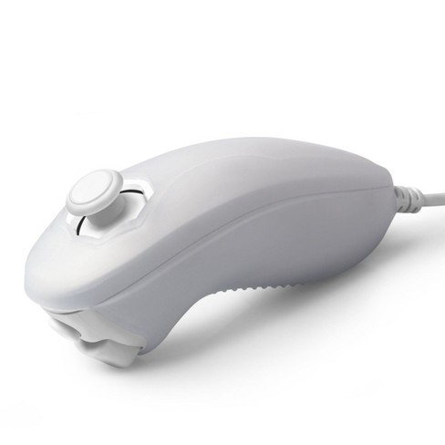

University project we did for our "Real Time System Programing 2" and "Fundamentals of Computer Networks 1" courses

Platform : Raspberry Pi 2 - Model B 
OS : Raspbian 2017

Client Side:

1)An i2c module on Raspberry Pi(ARM architecture) that reads the input from Nunchuk Wii joystick.

2)A web client application that gets the read data from the joystick and sends it to the server.

Server Side:

3)A server application that recieves data from the client and forwards it to the fake input module.

4)Fake input module that simulates keyboard input based on data received from the server(joystick action).

Mentors:

Real Time System Programing 2 : Prof. Miroslav Popović, Teaching Assistant Dejan Bokan.

Fundamentals of Computer Networks 1: Prof. Ilija Bašičević, Teaching Assistant Miloš Pilipović.

