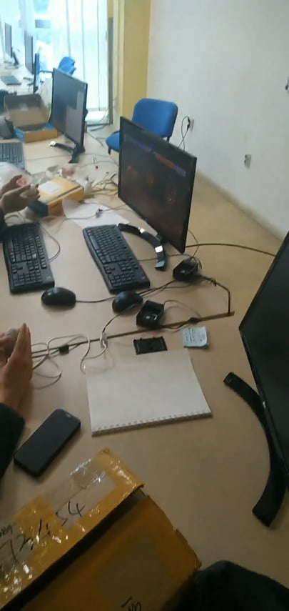

University project we did for our "Real Time System Programing 2" and "Fundamentals of Computer Networks 1" courses

Platform : Raspberry Pi 2 - Model B 

OS : Raspbian 2017

Team name: Empty Head

Team members:
1. Jelena Kretler
2. [Simeon Lagundzin](https://github.com/SimeonLag)
3. [Dario Perić](https://github.com/pericdario)

Client Side:

1)An i2c module on Raspberry Pi(ARM architecture) that reads the input from Nunchuk Wii joystick.

2)A web client application that gets the data from i2c module and sends it to the server

Server Side:

3)A server application that recieves data from the client and forwards it to the fake input module.

4)Fake input module that simulates keyboard input based on data received from the server(joystick action).

[Video](https://www.youtube.com/watch?v=AKCKFFHNbZQ&feature=youtu.be)

Mentors:

Real Time System Programing 2 : Prof. Miroslav Popović, Teaching Assistant Dejan Bokan

Fundamentals of Computer Networks 1: Prof. Ilija Bašičević, Teaching Assistant Miloš Pilipović

